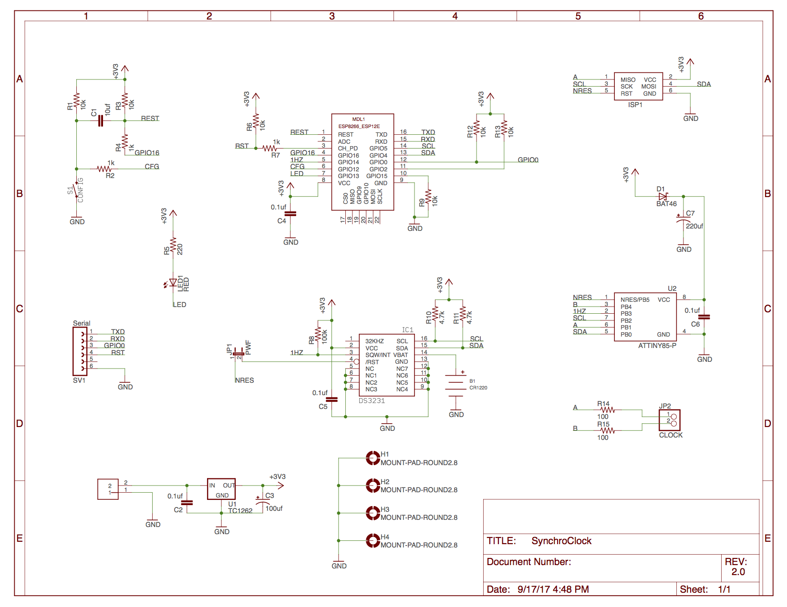

# AnalogClock 2.X

Project to sync analog clocks to a few milliseconds using NTP for time synchronization. Details of operation can be found in this [blog post](https://engineering.taboola.com/analog-clocks-ntp/)

[I2CAnalogClock](I2CAnalogClock) contains the code for the ATTiny85 as an I2C based Analog Clock controller.  I am now using [PlatformIO](https://platformio.org/) for development.

[SynchroClock](SynchroClock) contains the code for the ESP8266 module.   I am now using [PlatformIO](https://platformio.org/) for development.

[NTPTest](NTPTest) contains a framework for testing the NTP class in an accelerated manor on linux or MacOS saving days of waiting for results.

[eagle](eagle) contains the [Eagle](https://www.autodesk.com/products/eagle/overview) design files and the BOM.

## Features

* Automatic daylight saving time adjustments
* Clock position & configuration saved on power fail
* Low power consumption: approx. 0.25ma in early testing
* adjustable tick/adjust pulse width/duty cycle/delay should support most one second "tick" (non-sweep) clocks.
* NTP implementation computes drift and uses that to increase accuricy between NTP updates

## Configuration

   When the clock is initially powered on it creates a wifi captive portal.  It will show up in the list of available wifi networks as SynchroClockXXXXXXX (where the X’s are some number).  Configuration mode can be forced by holding down the reset button until the LED is turns on and stays on for at least 2 seconds then releasing it. NOTE that if you conrinue holding the reset button for more than 10 seconds the LED will go back off initiating a factory reset to default settings. When you connect to this you are given a menu that lets you set many configuration options:

* Wifi Network (SSID)
* Wifi Network password
* Clock Position - enter the current time shown on the clock as HH:MM:SS.
* NTP Server to sync with
* 1st time change as 6 fields (US/Pacific would be: 2 0 0 3 2 -25200 meaning the second Sunday in March at 2am we change to UTC-7 hours, and Israel: -1 0 -2 3 2 10800 meaning the Friday before the last Sunday of in March at 2am we change to UTC+3)
  * occurrence - 2 would be the second occurrence of the day of week specified, -1 would be the last one.
  * day of week - where 0 = Sunday
  * days offset - +|- days, used for "the Friday before the last Sunday"
  * month - where 1 = January
  * hour - where 0 = midnight
  * time offset - this is the offset in seconds from UTC
* 2nd time change as 5 fields as described above (US/Pacific: 1 0 0 11 2 -28800 meaning the first Sunday in November at 2am we change to UTC-8 hours, and Israel: -1 0 0 10 2 7200 meaning the last Sunday of October we change to UTC-2)

Advanced options:

* Stay Awake - when set true the ESP8266 will not use deep sleep and will run a small web servers allowing various operations to be performed with an http interface.
* Tick Pulse - this is the duration in milliseconds of the “tick”.
* Tick Duty Cycle - the percentage of time that the tick is on using PWM
* Adjust Start Pulse - this uis the duration in milliseconds of the initial pulse of an adjustment
* Adjust Pulse - this is the duration in milliseconds of the “tick” used to advance the clock rapidly.
* Adjust Duty Cycle - the percentage of time that the tick is on using PWM
* Adjust Delay - this is the delay in milliseconds between “ticks” when advancing the clock rapidly.
* Network Logger Host - (optional) hostname to send log lines to.
* Network Logger Port - (optional) tcp port to send log lines to.
* Clear NTP Persist - when set 'true' clears any saved adjustments and drift calculations.

## Schematic

